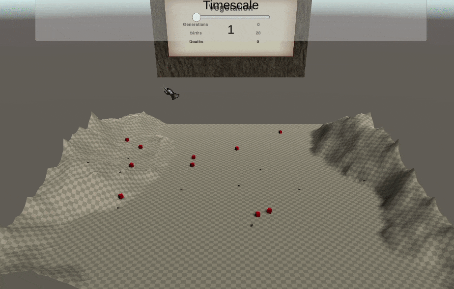
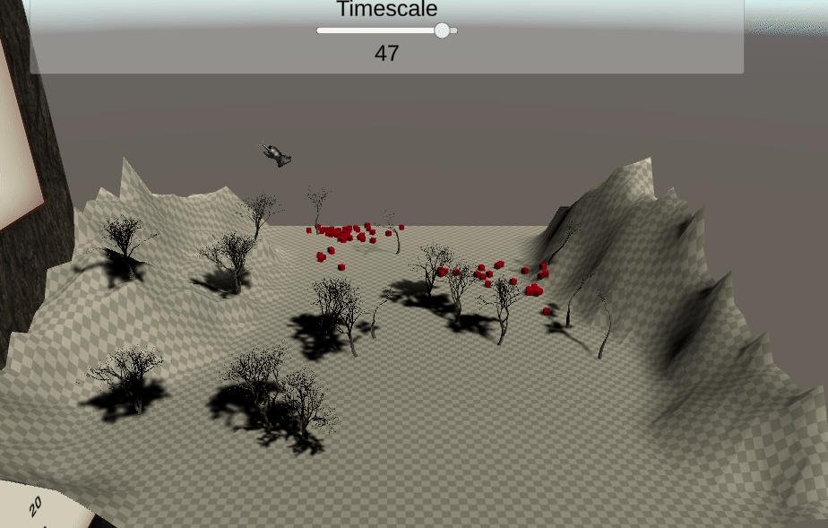
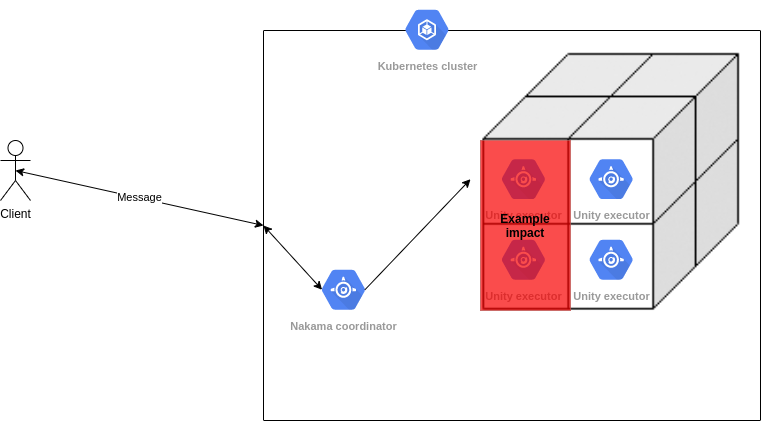

# niwrad





See related writings:

* [Blog post part one](https://medium.com/swlh/a-simulation-of-evolution-part-one-62a1acfb009a)

## How it works

[Nakama](https://github.com/heroiclabs/nakama) is used for network communication, kubernetes coordination & other stuffs.

### Architecture

Simulate physics is hard. Unity does it decently.  
It's easier to just use Unity for that instead of the Nakama server.



Nakama is used as a coordinator which spawn kubernetes nodes that handle each a specific box of the map.  
In other words a sharding strategy is used for the distributed system.  
An [Octree](https://github.com/louis030195/octree) data structure is used for that.  

### Features & direction

* Hosts (any life form) have characteristics.
* Hosts can reproduce (sexual only atm), when they do, their characteristics are "mixed" plus a slight randomness (mutation).
* Hosts behaviour code MUST be generic, so we can either implement simple heuristics like state-machines, behaviour trees or more complex like reinforcement learning.
* Hosts will evolve by natural selection, some characteristics that help survival (speed ... ?) will increase, some that harm survival will decrease.
* Players can trigger artificial selection, e.g. like we human selected the cows that produce the most milk, the goal is to implement actions that offer the possibility to influence evolution. Currently what came to my mind: any way to protect, harm, heal, feed ... some targeted hosts (high speed hosts ? big hosts ...)

## Usage

```bash
git clone https://github.com/louis030195/niwrad
```

### Prerequisites

#### Deployment

1. [Docker](https://www.docker.com)
2. [Install kubectl](https://kubernetes.io/docs/tasks/tools/install-kubectl/)
3. [Install helm](https://helm.sh/docs/intro/install/)
4. [Install minikube](https://kubernetes.io/docs/tasks/tools/install-minikube/) (for local k8s)

#### Client

1. [Unity](https://unity.com)
2. make: `sudo apt install make`
3. [protoc, protoc-gen-go, protoc-gen-csharp](https://github.com/protocolbuffers/protobuf) (optional)

```make
Usage: make <target>

Targets:
  help        Display this help
  build       Build unity client, docker images and protobufs
  build-client-artifact  Build unity client
  build-server-artifact  Build unity server
  build-unity-image  Build unity server docker image
  build-js-image  Build js client docker image
  build-integration-tests-image  Build integration tests docker image
  build-nakama-image  Build nakama docker image
  build-images  Build docker images
  build-proto  Build protobuf stubs
  deploy      Deploy cluster
  un-deploy   Un-deploy cluster
  client      Run client
  test        Run unit tests and integration tests
```

So you can try by deploying cluster & runnning client:

```bash
make deploy
make client
```

### TODO

* [x] [Medium] Unit testing Unity.
* [x] [Medium] Helm integration tests.
* [ ] [stale, Nakama-js doesn't support protobuf] [Medium] [JS client](https://www.npmjs.com/package/@heroiclabs/nakama-js) for bots and testing.
* [ ] [Easy] Implement "robot": a creature that will tweak evolution according to our will, e.g. "I want fast animals" it will kill all slow animals\
    Basically anything that can allow players to apply artificial selection
* [ ] [Easy] finish github workflow (github page deployment)
* [ ] [Easy] Android controller
* [ ] [Easy] Deploy persistent, resilient, fenced server on the cloud
* [ ] [Medium] Consider adding predators / parasites in order to trigger competition e.g. Red Queen hypothesis
* [ ] [Easy] Consider splitting in multiple repositories each component (Nakama, Unity, APIs: js) especially if things grows too much
* [ ] [Easy] Consider using lua and/or go but if both, both should always use protobuf messages, no json !!!
