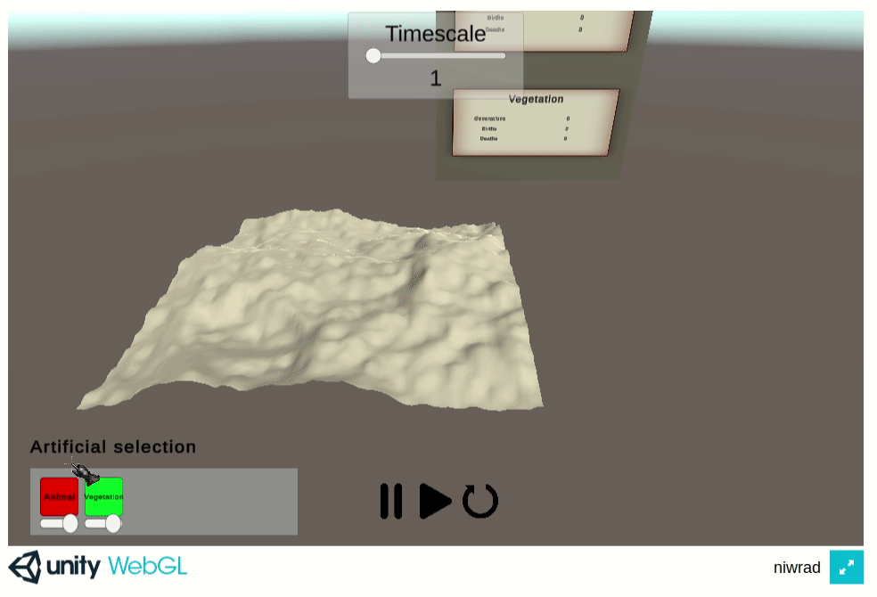

# niwrad

Try the offline WebGL version directly [here](http://louis030195.github.io/niwrad), if you want to try on other OS (Windows, Linux, Android, Web available) [check out latest Github Actions artifacts](https://github.com/louis030195/niwrad/actions) or releases.

**The development on online, multiplayer version is paused.**

See related writings:

* [Blog post part one](https://medium.com/swlh/a-simulation-of-evolution-part-one-62a1acfb009a)
* [Blog post part two](https://medium.com/@louis.beaumont/a-simulation-of-evolution-two-b26664d159a5)

## Features

* [x] Heuristic AI (state machine)
* [x] Artificial selection (partially)
  * [x] Spawn plants / animals by drag & drop
* [x] Parametrable experiences
  * [x] Working UX
* [x] Experience metrics (partially)
  * [x] Big ugly panel in game with number of animals ...
* [x] Optional carnivorous hosts
* [x] Android, Linux, Windows, Web, (iOS/MacOS not tested but should work)
  * [x] Mobile joysticks
  * [x] Passable UX
* [x] Multiplayer + singleplayer
  * [x] Can share experiences
  * [x] Leaderboard (naïve who had the most hosts alive = biggest computer)

## Dependencies

* Online mode: [Nakama](https://github.com/heroiclabs/nakama)
* Online mode: <https://github.com/louis030195/octree> for "network culling" i.e. if an animal moves in (1000,0,1000) and I'm in (0,0,0) I don't want to be notified of that.
* Online mode: deployments (Docker, Kubernetes, Helm, Minikube / k3s)
* Both: Unitask, Protobuf, TextMesh Pro, new unity input system

## Goals

* Hosts have characteristics. When hosts reproduce sexually or asexually, the offspring characteristics are its parent's plus mutations.
* Hosts behaviour code MUST be generic, so we can either implement simple heuristics like state-machines, behaviour trees, utility or try learning AI like reinforcement learning.
* Observers can trigger artificial selection, the goal is to implement actions that offer the possibility to influence evolution. Currently what came to my mind: any way to protect, harm, heal, feed ... some species

## Non-goals

* Simulating nature at the quantum level

## Development

[See](docs/DEVELOPMENT.md)
