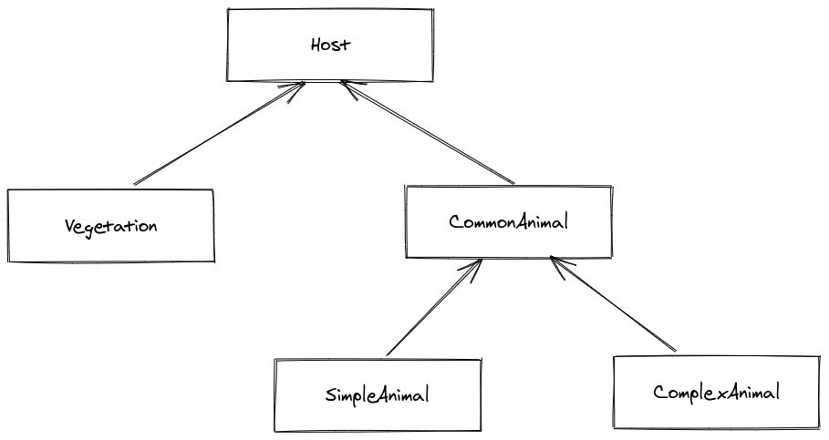

# Unity docs

## Project structure

### Assets

#### Scripts

##### Evolution

##### Tests

###### TestsEdit

Standard unit test.

###### TestsPlay

Similar to edit but better understanding with visual output, usually having a camera controller and expecting inputs from user to go next steps or stopping.
